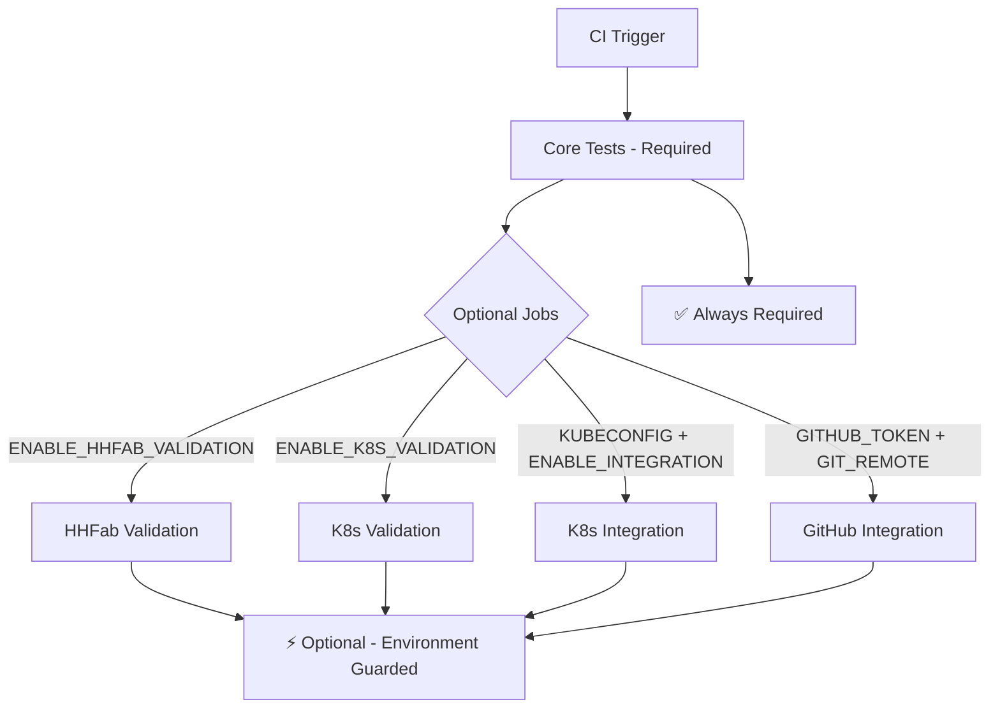

# CI Configuration Update Summary

## Overview

Successfully updated the CI configuration to include optional hhfab and K8s validation gates while maintaining required core validation pipeline.

## Changes Made

### 1. Package.json Script Updates ✅

**New validation scripts added:**
```json
{
  "validate:all": "npm run validate:core && npm run validate:optional",
  "validate:core": "npm run typecheck && npm run build && npm test -- --run",
  "validate:optional": "npm run validate:hhfab:ci && npm run validate:k8s:ci",
  "validate:k8s:ci": "scripts/load-env.sh && ([ \"$FEATURE_K8S\" = \"true\" ] && npm run validate:k8s || echo \"K8s validation skipped (FEATURE_K8S=${FEATURE_K8S:-false})\")",
  "validate:integration": "npm run int:gh:ci && npm run int:k8s:ci",
  "validate:ci": "npm run validate:core && npm run e2e && npm run build-storybook && npm run test-storybook"
}
```

**Key Features:**
- Environment guards prevent failures when tools are unavailable
- Clear separation between core (required) and optional validation
- Comprehensive validation coverage with `validate:all`

### 2. GitHub Actions CI Updates ✅

**New optional validation jobs:**

1. **`validation-hhfab`**
   - Triggers: `ENABLE_HHFAB_VALIDATION=true` or manual dispatch
   - Environment: `HHFAB` variable for CLI path
   - Command: `npm run validate:hhfab:ci`

2. **`validation-k8s`** 
   - Triggers: `ENABLE_K8S_VALIDATION=true` or manual dispatch
   - Environment: `FEATURE_K8S=true`
   - Command: `npm run validate:k8s:ci`

3. **Enhanced `integration-k8s`**
   - Improved triggers with multiple conditions
   - Better environment variable handling
   - Clearer separation from validation-only jobs

**Workflow Dispatch Inputs:**
```yaml
workflow_dispatch:
  inputs:
    enable_hhfab_validation:
      description: 'Enable HHFab validation'
      type: boolean
    enable_k8s_validation:
      description: 'Enable K8s validation'
      type: boolean
    enable_integration:
      description: 'Enable integration tests'
      type: boolean
```

### 3. Environment Configuration ✅

**Updated .env.example with comprehensive options:**
```bash
# === Core Configuration ===
HNC_VERBOSE=false

# === Validation Configuration ===
HHFAB=/usr/local/bin/hhfab
FEATURE_HHFAB=false
FEATURE_K8S=false
FEATURE_GIT=false

# === Integration Configuration ===
GITHUB_TOKEN=your_github_token_here
GIT_REMOTE=origin
KUBECONFIG=~/.kube/config

# === CI/CD Configuration ===
# ENABLE_HHFAB_VALIDATION=true
# ENABLE_K8S_VALIDATION=true
# ENABLE_INTEGRATION_TESTS=true
```

### 4. Documentation ✅

**Created comprehensive guides:**
- `/docs/ci-validation-setup.md` - Complete setup and troubleshooting guide
- `/docs/ci-update-summary.md` - This summary document

**Documentation covers:**
- Environment variable configuration
- Repository secrets and variables setup
- NPM script reference
- Manual workflow dispatch instructions
- Troubleshooting common issues

## Validation Testing ✅

**Successfully verified:**

1. **Script Execution:**
   - ✅ `npm run validate:optional` executes both validations
   - ✅ `npm run validate:hhfab:ci` runs with proper environment guard
   - ✅ `npm run validate:k8s:ci` skips gracefully when `FEATURE_K8S=false`

2. **Environment Guards:**
   - ✅ K8s validation skips with clear message when feature disabled
   - ✅ HHFab validation checks tool availability before execution
   - ✅ No failures due to missing optional dependencies

3. **GitHub Actions Syntax:**
   - ✅ YAML configuration validates successfully
   - ✅ Job conditions use proper GitHub Actions syntax
   - ✅ Environment variables properly referenced

## CI Pipeline Architecture



## Required vs Optional Jobs

### Always Required (Must Pass)
- Core Tests (Node 18 & 20 matrix)
  - TypeScript type checking
  - Application build  
  - Unit tests
  - E2E golden path test
  - Storybook build and test

### Optional (Environment Controlled)
- HHFab validation (`validation-hhfab`)
- K8s validation (`validation-k8s`) 
- K8s integration (`integration-k8s`)
- GitHub integration (`integration-github`)

## Repository Configuration

### Secrets (Required for Integration Tests)
- `KUBECONFIG`: Base64-encoded Kubernetes config
- `GITHUB_TOKEN`: GitHub API token

### Variables (Control Optional Validation)
- `ENABLE_HHFAB_VALIDATION=true`: Enable HHFab validation
- `ENABLE_K8S_VALIDATION=true`: Enable K8s validation  
- `ENABLE_INTEGRATION_TESTS=true`: Enable integration tests
- `HHFAB=/path/to/hhfab`: HHFab CLI path (optional)

## Benefits Achieved

1. **Backward Compatibility**: Core pipeline unchanged, no breaking changes
2. **Environment Flexibility**: Validation runs only when tools are available
3. **Clear Separation**: Required vs optional validation clearly distinguished  
4. **Comprehensive Coverage**: All validation types properly integrated
5. **Graceful Degradation**: Missing tools don't cause CI failures
6. **Manual Control**: Workflow dispatch allows ad-hoc validation testing

## Next Steps

1. **Repository Setup**: Configure repository variables for desired validations
2. **Team Training**: Share documentation with development team
3. **Monitoring**: Track validation job performance and success rates
4. **Iteration**: Refine validation criteria based on feedback

## Status: ✅ Complete

CI configuration successfully updated with comprehensive optional validation gates while maintaining required core validation pipeline.